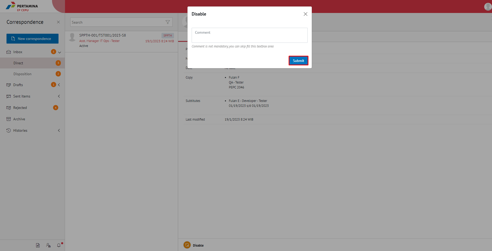

**Role yang sesuai**

- *Approver User* (Pejabat Pth)
- *Reviewer User* (Pejabat Pth)

SPPTH yang masih berlaku akan non-aktif secara otomatis apabila sudah habis masa jabatan pejabat yang sedang di PTH-kan.  Namun, apabila pejabat definitif kembali bekerja sebelum masa PTH nya habis, maka pejabat tersebut harus menon-aktifkan SPPTH yang berlaku dengan cara sebagai berikut:

## **E-Corr Versi Web**

Langkah - langkah untuk menonaktifkan SPPTH via Web adalah sebagai berikut :

1. Klik menu **Inbox - Direct** dan pilih surat dengan label **SPPTH** yang akan dinon-aktifkan.

2. Pada tab **detail** pilih _icon_ **Disable**. Kemudian Pilih **Submit**. Berikan komentar jika perlu.

 

3. SPPTH yang sudah tidak aktif akan tersimpan di menu "**Sent Item - Direct**" *approver*. Untuk pejabat PTH dan pejabat yang meninggalkan tempat, surat akan tersimpan di menu "**Inbox**".

