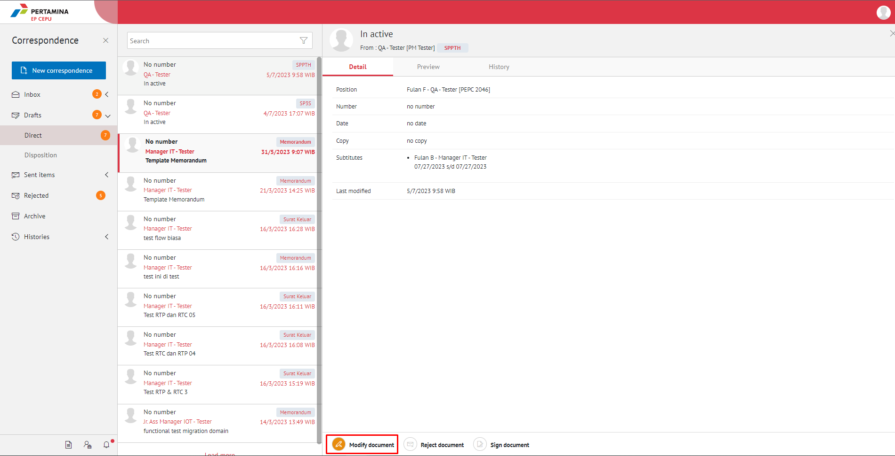
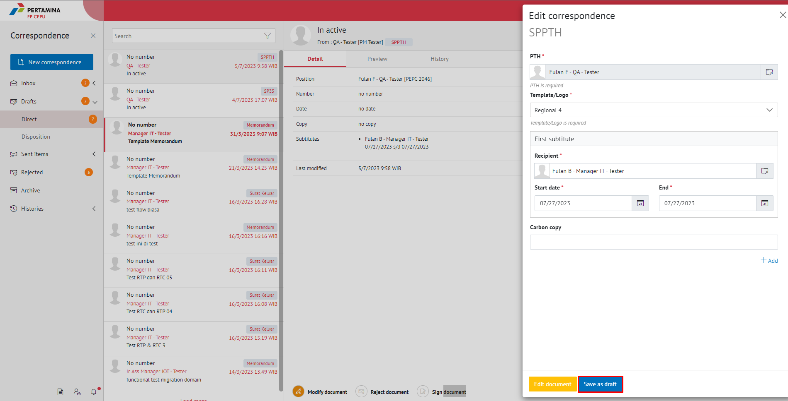
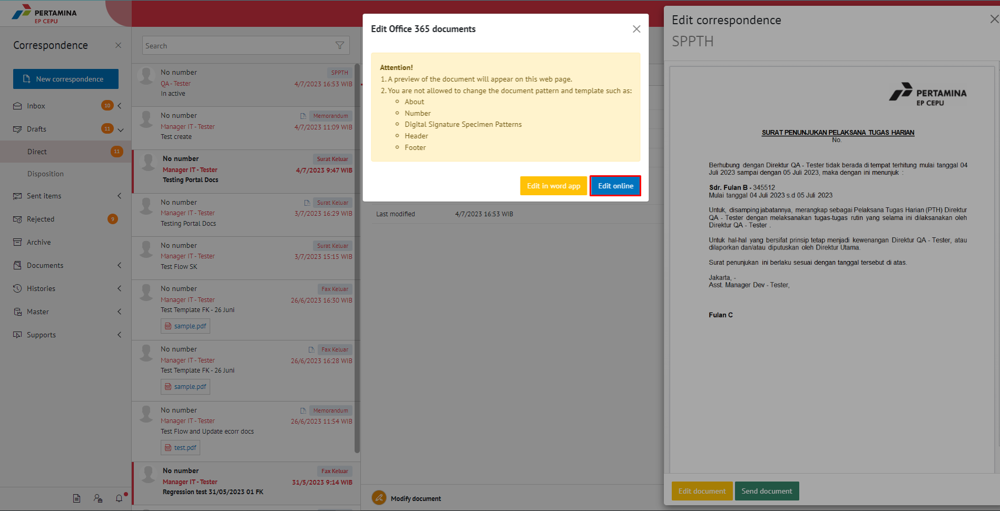

**Role yang sesuai**

- *Approver User*

*User* dapat merevisi SPPTH yang sudah dikirimkan oleh konseptor. 

## **E-Corr Versi Web**

Langkah - langkah untuk melakukan revisi SPPTH via Web adalah sebagai berikut :

1. Klik menu **Draft - Direct** dan pilih surat dengan label **SPPTH**

2. Pilih SPPTH yang akan disetujui kemudian pilih tab **Detail**

3. Klik tombol **Modify Document**.

4. Lakukan perubahan pada *form*. Klik **Save as Draft** untuk menyimpan perubahan pada *form* SPPTH.

5. Surat yang disimpan akan tersimpan di menu "**Draft - Direct**".

#### **[Edit] Word Desktop**

Langkah - langkah untuk mengubah isi SPPTH melalui Word Desktop adalah sebagai berikut

1. Klik **Edit in word app** untuk mengubah melalui aplikasi Microsoft Word

2. Lakukan perubahan pada isi surat. Klik **Close** pada aplikasi dan isi surat akan otomatis tersimpan

#### **[Edit] Ubah Online**

Langkah - langkah untuk mengubah isi SPPTH secara *online* adalah sebagai berikut

1. Klik **Edit Online** untuk mengubah isi surat secara *online*

2. Lakukan perubahan pada isi surat. Klik **Close** pada aplikasi

3. Isi surat akan otomatis tersimpan. Jika surat akan disimpan sebagai draft, maka klik **Yes**

4. Surat yang sudah selesai diubah maka akan tersimpan di menu **"Draft - Direct"**.

## **E-Corr Versi Mobile (Android & iOS)**

Langkah - langkah untuk revisi SPPTH via Android dan iOS adalah sebagai berikut :

1. Klik menu **Draft** dan pilih Surat dengan label **SPPTH**

 

2. Pada halaman **Detail**  klik icon **Option**

3. Pilih button **Modify Document** kemudian lakukan _editting_ SPPTH.

4. Lakukan perubahan pada _form_. Klik **Save Mail** untuk menyimpan perubahan pada _form_ SPPTH. Surat yang disimpan akan tersimpan di menu “**Draft**"

 

5. Klik **Edit Document** untuk mengubah isi SPPTH
   

6. Sistem menampilkan tampilan _preview_ SPPTH dalam bentuk Word yang dapat di edit. Untuk melakukan _editing_ terhadap isi surat klik **Edit Document** kemudian sistem akan menampilkan _pop up_ konfirmasi.

#### **[Edit] Ubah Online**

Langkah – langkah untuk mengubah isi SPPTH secara online adalah sebagai berikut :

1. Klik  **button Edit** untuk mengubah isi surat secara online

 

2. Lakukan perubahan pada isi surat. lalu sistem akan menampilkan pop up E-Corr Editing Document pilih **Yes**

3. Isi surat akan otomatis tersimpan. Jika surat akan disimpan sebagai draft, maka klik **back** kemudian sistem akan menampilkan pop up konfirmasi, lalu pilih **yes**. 

 

4. Surat yang sudah selesai diubah maka akan tersimpan di menu “**Draft**".

