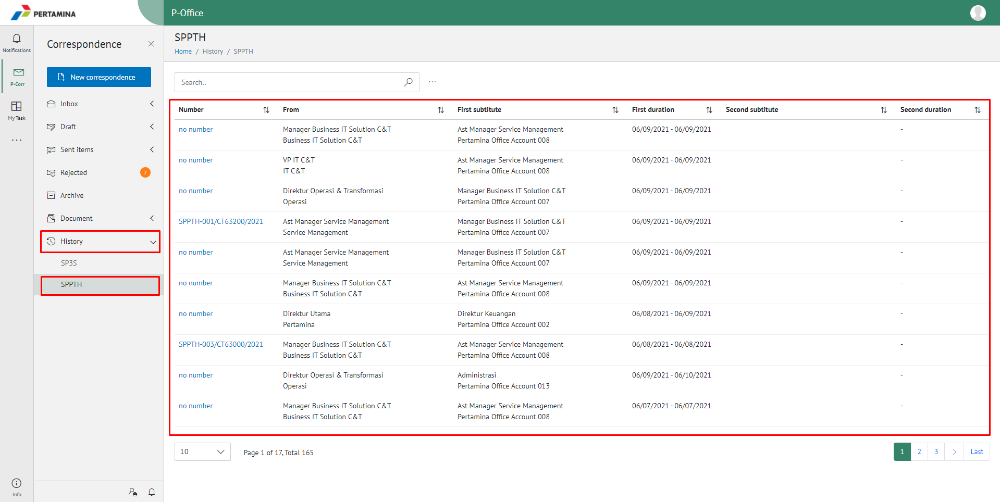
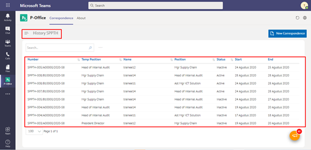

**Role yang sesuai**

- *Approver User*
- *Reviewer User*
- Sekretaris

*User* dapat melihat informasi pejabat yang sedang menjabat sebagai Pth baik dalam status aktif maupun non-aktif. Informasi yang ditampilkan meliputi nomor SPPTH, Nama pejabat, jabatan dan status. 

## **P-Office Versi Web**

Langkah - langkah untuk riwayat SPPTH via Web adalah sebagai berikut :

1. Klik menu **History** dan pilih sub-menu **SPPTH**

2. Sistem menampilkan riwayat SPPTH

## **P-Office Versi Teams**

Langkah - langkah untuk riwayat SPPTH via Teams adalah sebagai berikut :

1.	Klik menu **History** dan pilih tab **SPPTH**

 
2.	Sistem menampilkan riwayat SPPTH
