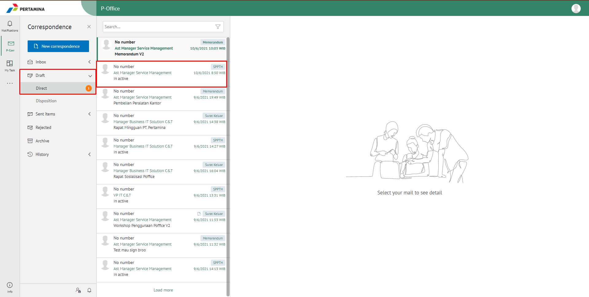
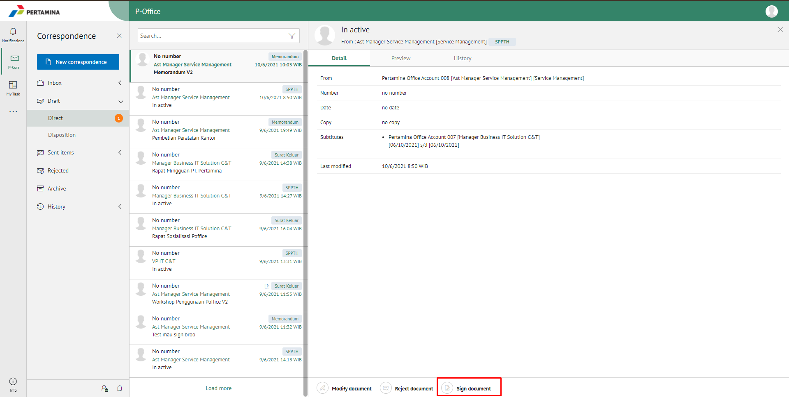
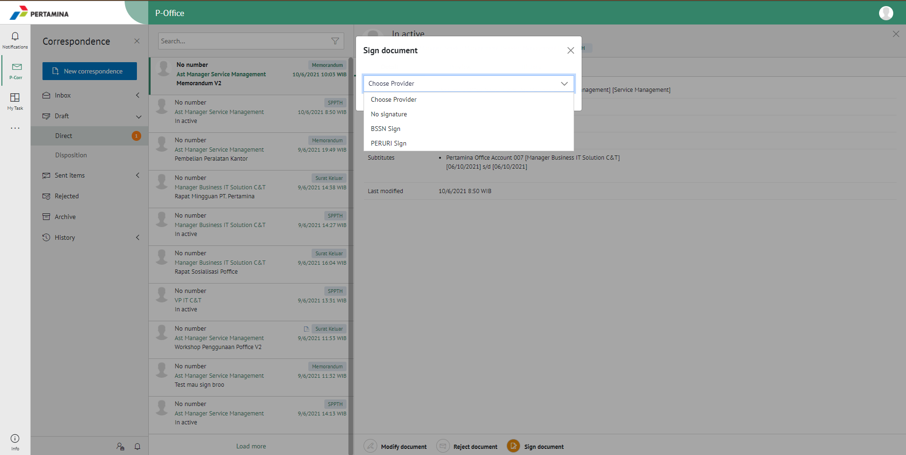
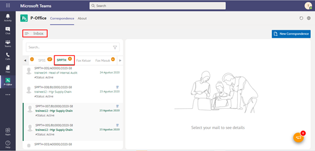
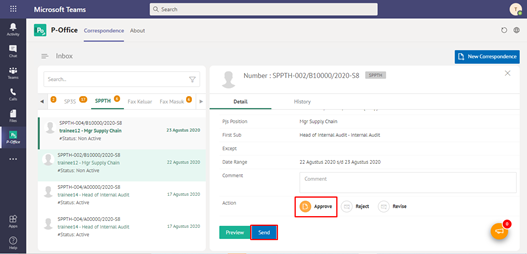
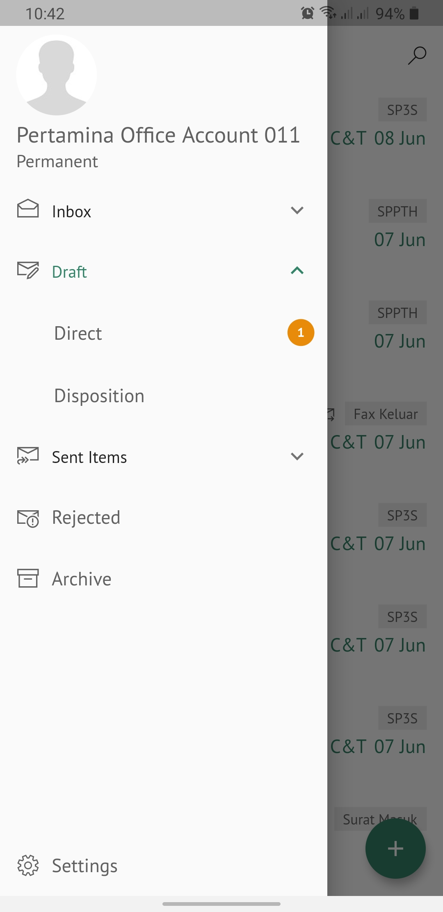
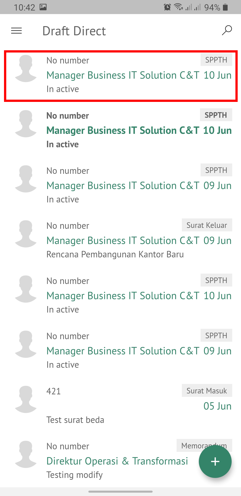
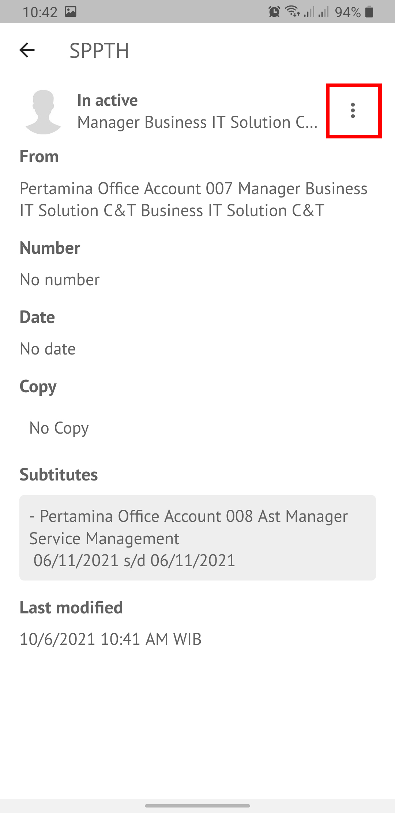
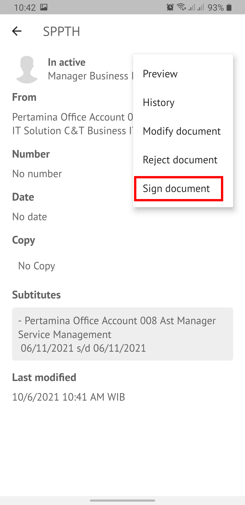
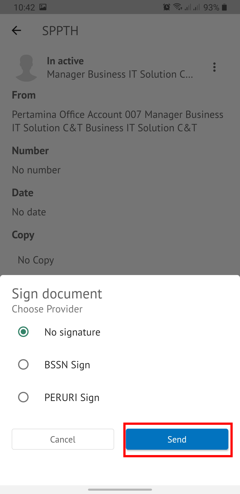

**Role yang sesuai**

- *Approver User*

*User* dapat menyetujui SPPTH yang sudah dikirimkan oleh konseptor sehingga nomor SPPTH akan ter-*generate* secara otomatis. 

## **P-Office Versi Web**

Langkah - langkah untuk menyetujui SPPTH via Web adalah sebagai berikut

1. Klik menu **Draft** dan pilih surat berlabel **SPPTH**.

2. Pilih SPPTH yang akan disetujui kemudian pilih tab **Detail**.

3. Klik tombol **Sign Document** dan pilih provider sign yang akan digunakan. 

4. Sistem berhasil menyimpan perubahan. SPPTH yang sudah di kirim akan tersimpan di menu **Sent Item**

## **P-Office Versi Teams**

Langkah - langkah untuk setujui SPPTH via Teams adalah sebagai berikut :

1.	Klik menu **Inbox** dan pilih tab **SPPTH**

 
2.	Pilih SPPTH yang akan disetujui kemudian pilih tab **Detail**

 
3.	Klik tombol **Approve** dan pilih **Send**. Isikan komentar jika diperlukan

4.	Sistem berhasil menyimpan perubahan. SPPTH yang sudah di kirim akan tersimpan di menu Sent Item – SPPTH

## **P-Office Versi Mobile (Android & iOS)**

Langkah - langkah untuk setujui SPPTH via Android dan iOS adalah sebagai berikut :

1. Klik menu **Draft** dan pilih surat berlabel **SPPTH** yang akan disetujui.
   
 

2. Pilih _icon_ **Option** Kemudian pilih **Sign Document**.

 

3. Pilih provider _sign_ yang akan digunakan kemudian pilih **Send**.

 

4. Sistem berhasil menyimpan perubahan. SPPTH yang sudah disetujui akan tersimpan di menu **Sent Item**.

