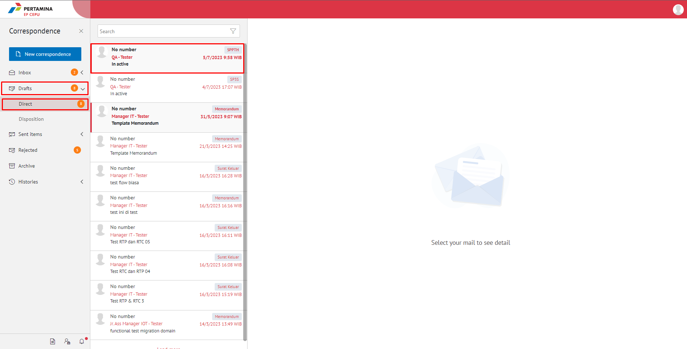
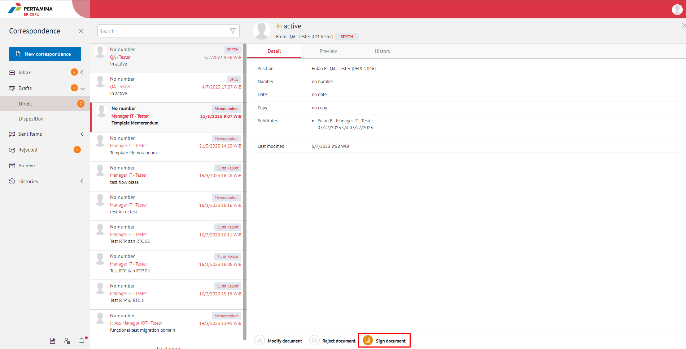
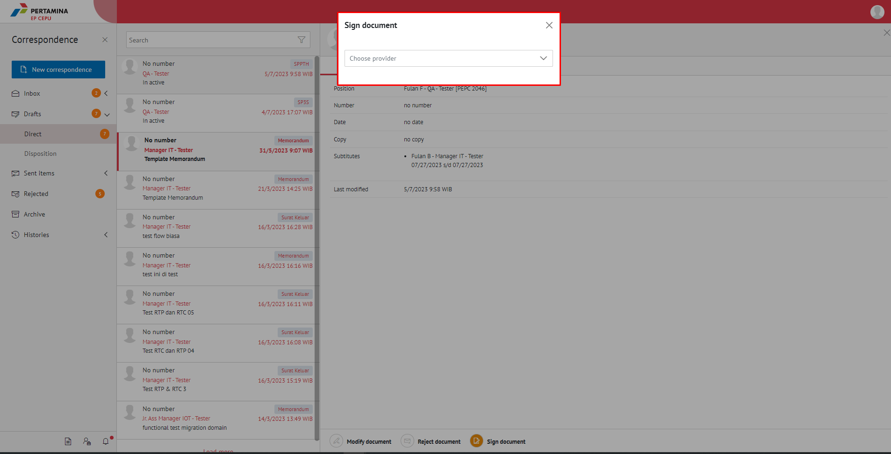

**Role yang sesuai**

- *Approver User*

*User* dapat menyetujui SPPTH yang sudah dikirimkan oleh konseptor sehingga nomor SPPTH akan ter-*generate* secara otomatis. 

## **E-Corr Versi Web**

Langkah - langkah untuk menyetujui SPPTH via Web adalah sebagai berikut

1. Klik menu **Draft - Direct** dan pilih surat yang berlabel **SPPTH**.

2. Pilih SPPTH yang akan disetujui kemudian pilih tab **Detail**.

3. Klik tombol **Sign Document** dan pilih provider sign yang akan digunakan. 

4. Sistem berhasil menyimpan perubahan. SPPTH yang sudah di kirim akan tersimpan di menu **Sent Item**

