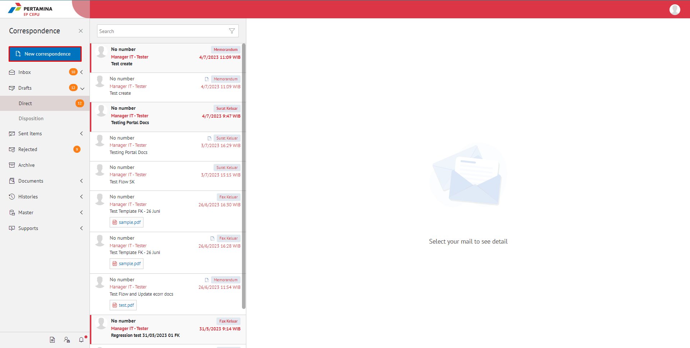
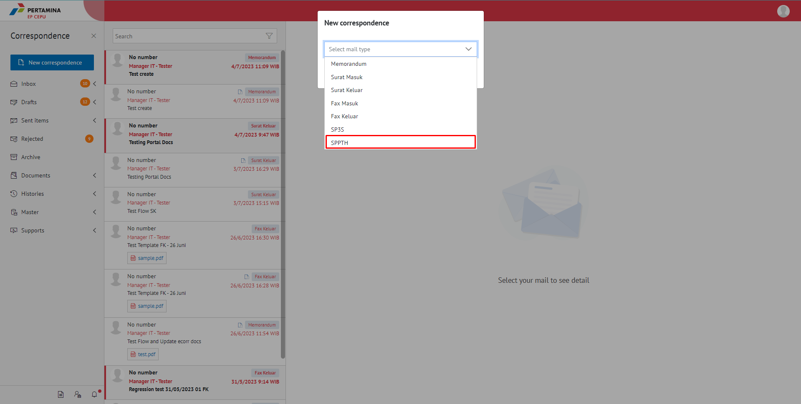
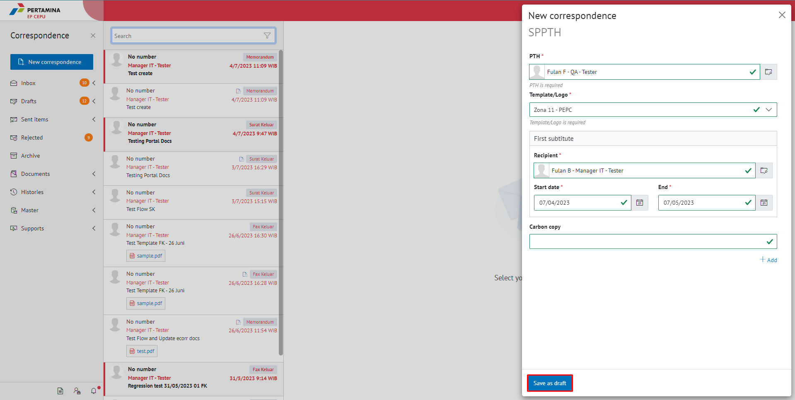
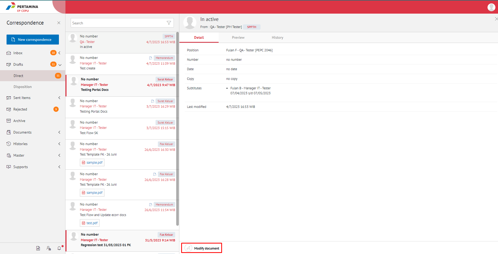
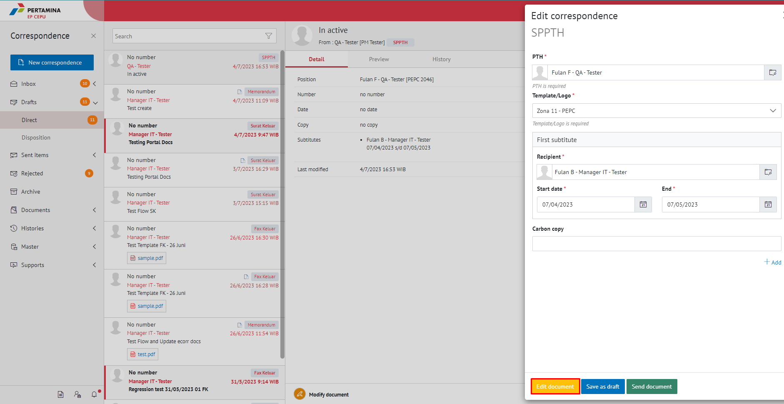
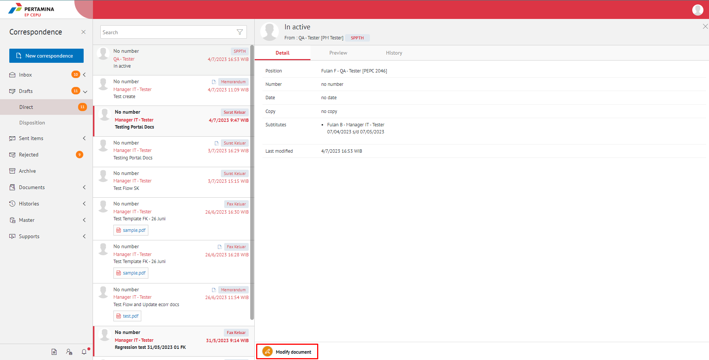
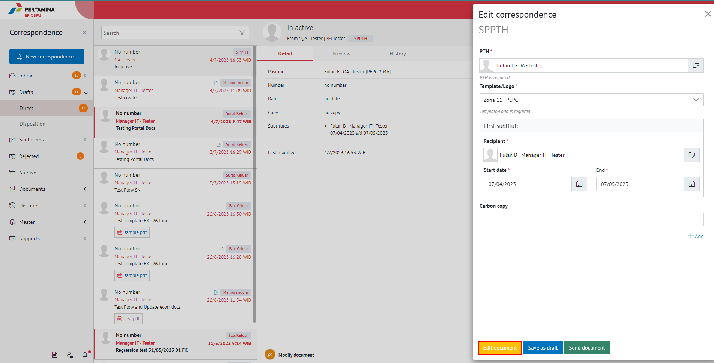

**Role yang sesuai**

- *Approver User*
- *Reviewer User*
- Sekretaris

SPPTH dibuat oleh konseptor/sekretaris Direksi yang akan meninggalkan tempat, sedangkan *approver* adalah Direktur Utama atau Pjs. Direktur Utama.

## **E-Corr Versi Web**

Langkah - langkah untuk menambah SPPTH via Web adalah sebagai berikut

1. Klik menu **New Correspondence**

2. Pilih jenis surat "**SPPTH**"

.

####  **Simpan SPPTH**

Langkah - langkah untuk menyimpan SPPTH adalah sebagai berikut.

1. Isi *form* SPPTH kemudian klik **Save as Draft**

#### **[Edit] Word Desktop**

Langkah - langkah untuk mengubah isi SPPTH melalui Word Desktop adalah sebagai berikut.

1. Pada **menu Draft - Direct**, pilih surat jenis **SPPTH** yang ingin diubah, kemudian pilih aksi **modify Document**.

2. Klik **Edit Document** untuk mengubah **SPPTH**.

3. Klik **Edit in Word App** untuk mengubah melalui aplikasi Microsoft Word

4. Lakukan perubahan pada isi surat. Klik **Close** pada aplikasi dan isi surat akan otomatis tersimpan

#### **[Edit] Ubah Online**

Langkah - langkah untuk mengubah isi SPPTH secara online adalah sebagai berikut.

1. Pada **menu Draft - Direct**, pilih surat yang berlabel **SPPTH** yang ingin diubah, kemudian pilih aksi **Modify Document**.

2. Klik **Edit Document** untuk mengubah **SPPTH**.

3. Klik **Edit Online** untuk mengubah isi surat secara online

4. Lakukan perubahan pada isi surat. Klik **Close** pada aplikasi

5. Isi surat akan otomatis tersimpan. Jika surat akan disimpan sebagai draft, maka klik **Yes**

6. Surat yang sudah selesai diubah maka akan tersimpan di menu "**Draft - Draft Direct**"

#### **Kirim SPPTH**

Langkah - langkah untuk mengirim SPPTH adalah sebagai berikut.

1. Pada tampilan *preview* SPPTH, klik **Send Document** untuk mengirim SPPTH ke *approver*

2. Setelah mengirim SPPTH, sistem akan menyimpan SPPTH di menu "**Sent Items - Direct**".

