**Role yang sesuai**

- *Approver User*
- *Reviewer User*
- Sekretaris

SPPTH dibuat oleh konseptor/sekretaris Direksi yang akan meninggalkan tempat, sedangkan *approver* adalah Direktur Utama atau Pjs. Direktur Utama.

## **P-Office Versi Web**

Langkah - langkah untuk menambah SPPTH via Web adalah sebagai berikut

1. Klik menu **New Correspondence**

2. Pilih jenis surat "**SPPTH**"

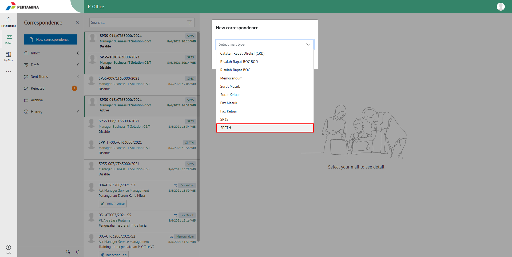

3. Isi *form* tambah SPPTH. Terdapat beberapa aksi untuk menindaklanjuti SPPTH yang sudah diisi *form* nya yaitu **Save as  Draft** dan **Send Document**.

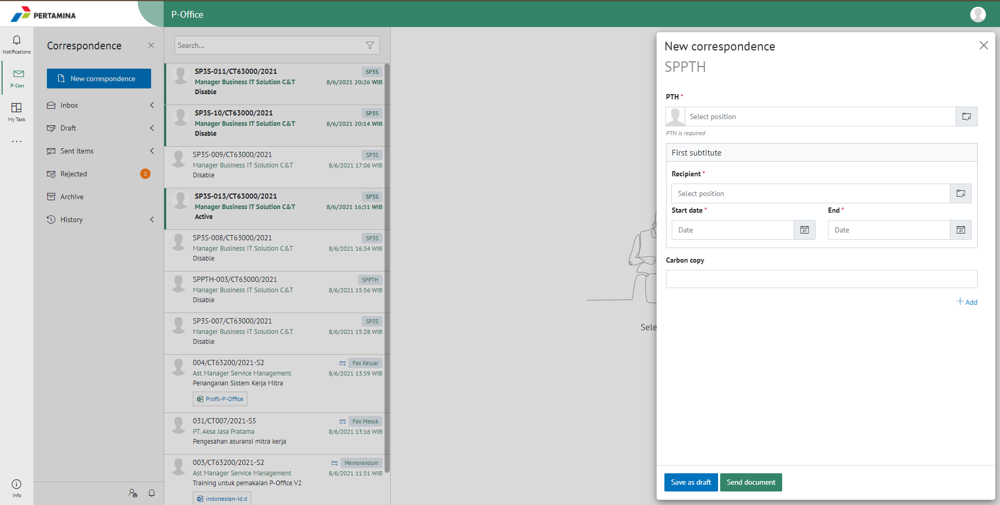

####  **Simpan SPPTH**

Langkah - langkah untuk menyimpan SPPTH adalah sebagai berikut.

1. Isi *form* SPPTH kemudian klik **Save as Draft**

#### **[Edit] Word Desktop**

Langkah - langkah untuk mengubah isi SPPTH melalui Word Desktop adalah sebagai berikut.

1. Pada **menu draft**, pilih **SPPTH** yang ingin diubah, kemudian pilih aksi **modify Document**.

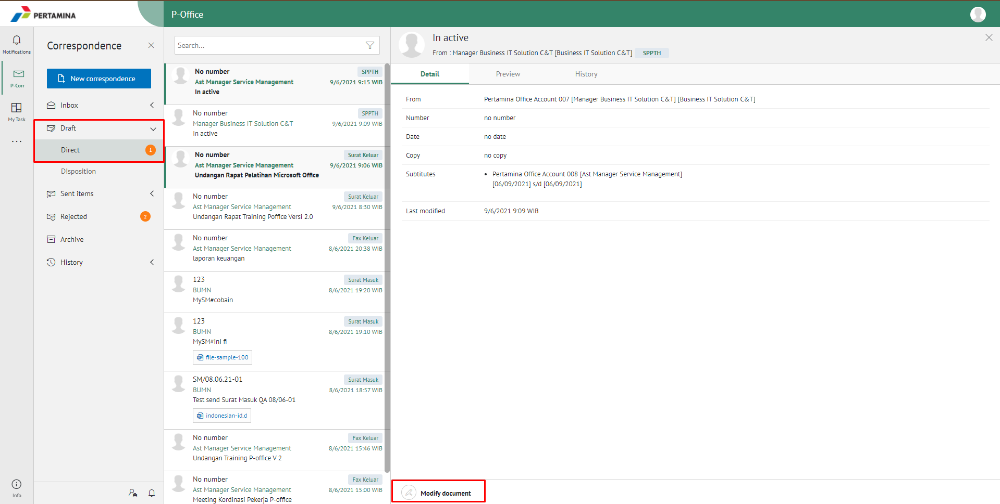

2. Klik **Edit Document** untuk mengubah **SPPTH**.

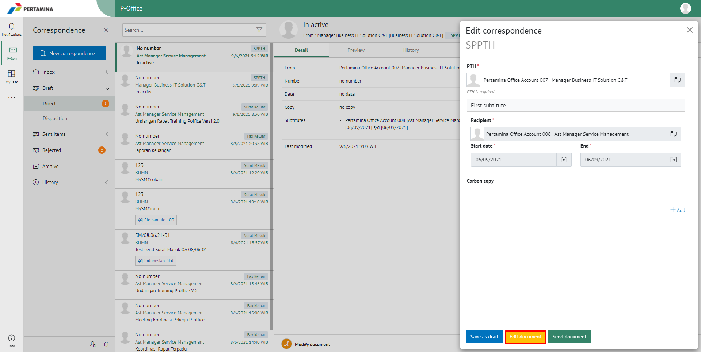

3. Klik **Edit in Word App** untuk mengubah melalui aplikasi Microsoft Word

4. Lakukan perubahan pada isi surat. Klik **Close** pada aplikasi dan isi surat akan otomatis tersimpan

#### **[Edit] Ubah Online**

Langkah - langkah untuk mengubah isi SPPTH secara online adalah sebagai berikut.

1. Pada **menu draft**, pilih **SPPTH** yang ingin diubah, kemudian pilih aksi **modify Document**.

2. Klik **Edit Document** untuk mengubah **SPPTH**.

3. Klik **Edit Online** untuk mengubah isi surat secara online

4. Lakukan perubahan pada isi surat. Klik **Close** pada aplikasi

5. Isi surat akan otomatis tersimpan. Jika surat akan disimpan sebagai draft, maka klik **Close.**

6. Surat yang sudah selesai diubah maka akan tersimpan di menu "**Draft - SPPTH**"

#### **Kirim SPPTH**

Langkah - langkah untuk mengirim SPPTH adalah sebagai berikut.

1. Pada tampilan *preview* SPPTH, klik **Send Document** untuk mengirim SPPTH ke *approver*

2. Setelah mengirim SPPTH, sistem akan menyimpan SPPTH di menu "**Sent Item - SPPTH**".

## **P-Office Versi Teams**

Langkah - langkah untuk menambah SPPTH via Teams adalah sebagai berikut :

1.  Klik menu **New Correspondence**

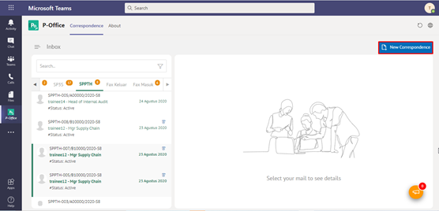

2.	Pilih jenis surat “**SPPTH**”

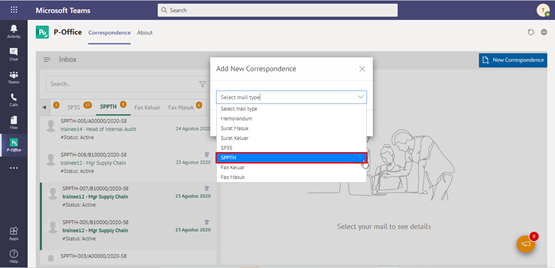

3.	Isi form tambah SPPTH. Terdapat beberapa aksi untuk menindaklanjuti SPPTH yang sudah diisi formnya yaitu **Save SPPTH** dan **Cancel SPPTH.**

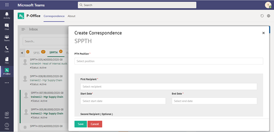

#### **Simpan SPPTH**

Langkah – langkah untuk menyimpan SPPTH adalah sebagai berikut.

1.	Isi form SPPTH kemudian klik **Save**

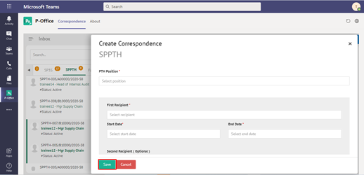

2.	Sistem akan menampilkan tampilan preview SPPTH dalam bentuk Word yang dapat di edit. Untuk melakukan editing terhadap isi surat klik **Edit Content** kemudian sistem akan menampilkan pop up konfirmasi **Ubah Word Desktop** atau **Ubah Online**

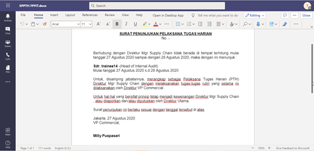

#### **[Edit] Word Desktop**

Langkah – langkah untuk mengubah isi SPPTH melalui Word Desktop adalah sebagai berikut.

1.    Klik **Open In Desktop App** untuk mengubah melalui aplikasi Microsoft Word

2.    Lakukan perubahan pada isi surat. Klik **Close** pada aplikasi dan isi surat akan otomatis tersimpan

#### **[Edit] Ubah Online**

Langkah – langkah untuk mengubah isi SPPTH secara online adalah sebagai berikut.

1.    Ketika Klik button **Edit Content** maka secara otomatis akan membuka dokumen dan bisa mengubah isi surat secara online

2.    Lakukan perubahan pada isi surat.

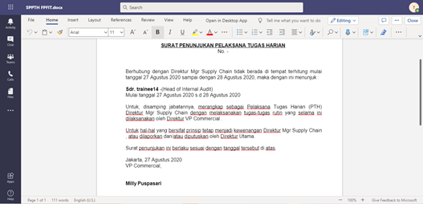

3.    Isi surat akan otomatis tersimpan. Jika surat akan disimpan sebagai draft, maka klik **Close** 

4.    Surat yang sudah selesai diubah maka akan tersimpan di menu **“Draft”**

#### **Kirim SPPTH**

Langkah – langkah untuk mengirim SPPTH adalah sebagai berikut.

1.	Pada tampilan preview SPPTH, klik **Send** untuk mengirim SPPTH ke approver

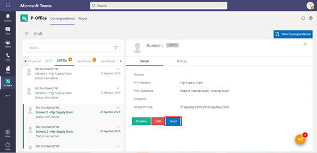

2. Sistem menyimpan perubahan dan SPPTH akan tersimpan di menu **“Sent Item”**

## **P-Office Versi Mobile (Android & iOS)**

Langkah - langkah untuk tambah SPPTH via Android dan iOS adalah sebagai berikut :

1. Klik ikon **(+)** pada SPPTH

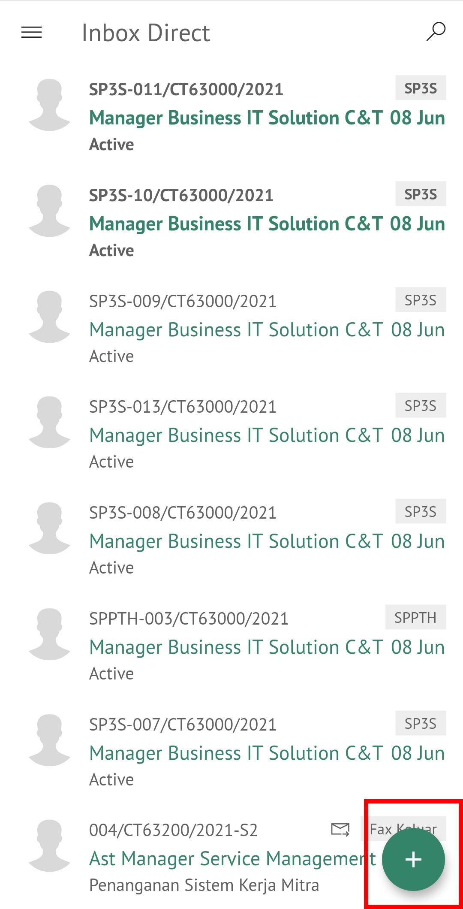

2. Pilih jenis surat “**SPPTH**”

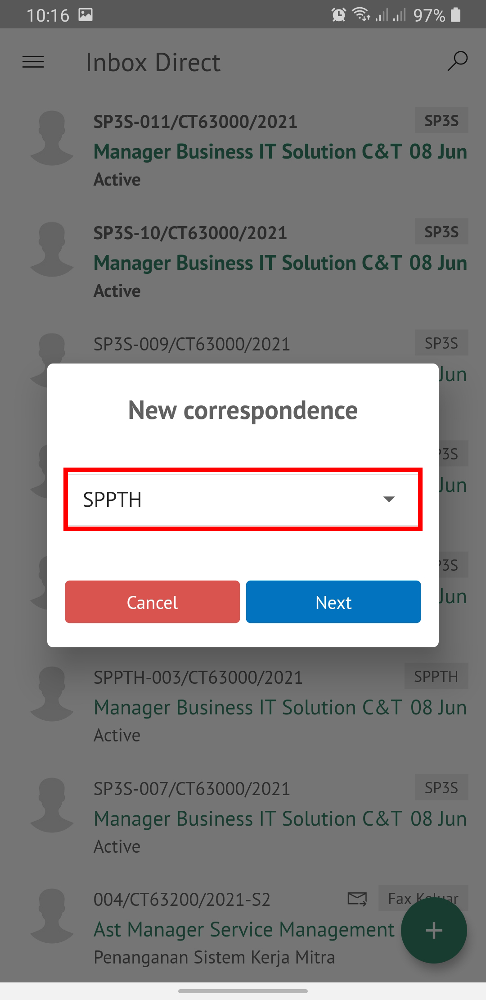

3. Isi _form_ tambah SPPTH. pilih **Next** terdapat aksi untuk menindaklanjuti SPPTH yang sudah diisi _form_ nya yaitu **Save as Draft** dan **Send Document**.

 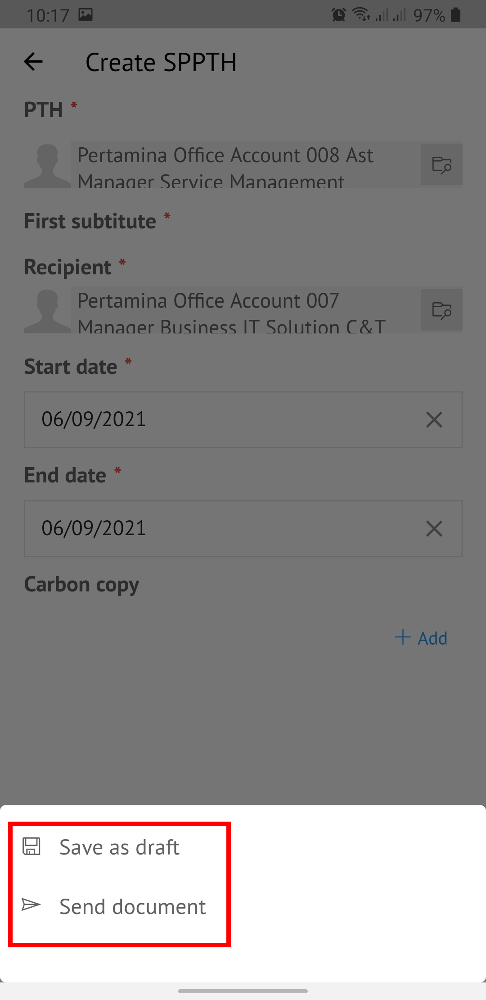

#### **Simpan SPPTH**

Langkah – langkah untuk menyimpan SPPTH adalah sebagai berikut.

1. Isi _form_ SPPTH kemudian klik **Next**

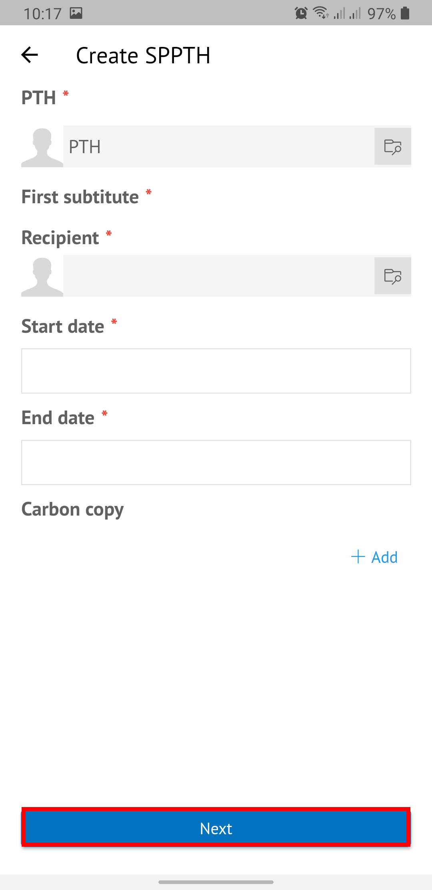 

2. Sistem akan menampilkan pilihan aksi yaitu **Save as Draft** dan **Send Document**. Pilih **Save as Draft** untuk menyimpan SPPTH.

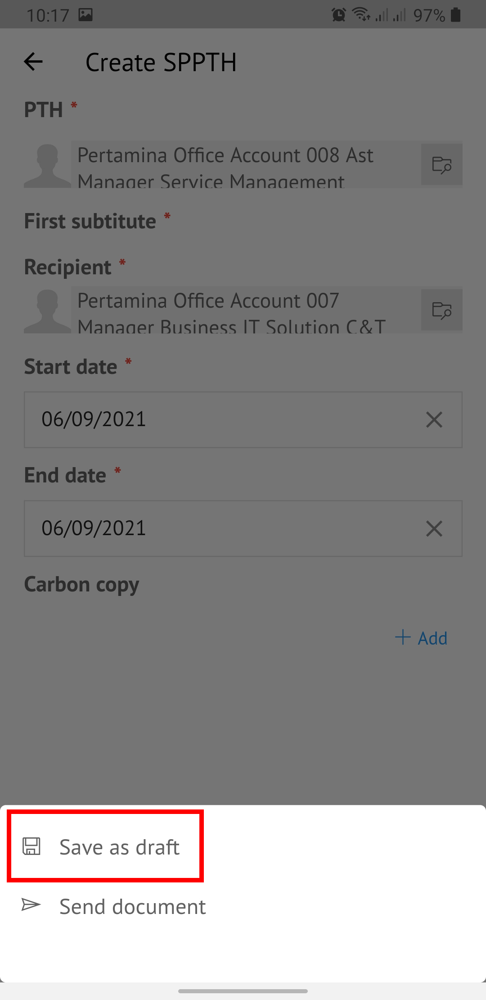

3. Surat yang sudah selesai diubah maka akan tersimpan di menu **“Draft”**

#### **[Edit] Ubah Online**

Langkah – langkah untuk mengubah isi SPPTH secara online adalah sebagai berikut.

1. Klik titik **tiga** pada Detail SPPTH. Kemudian pilih **Modify Document** untuk mengubah isi surat secara online

 

2. Pilih **Next** kemudian Pilih **Edit Document**.

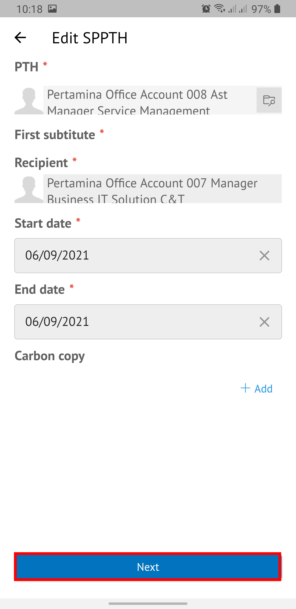 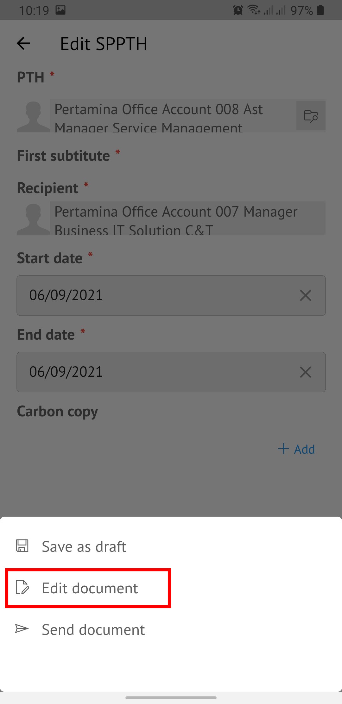

3. Lakukan perubahan pada isi surat lalu sistem akan menampilkan pop up P-Office Editing Document pilih **Yes**

 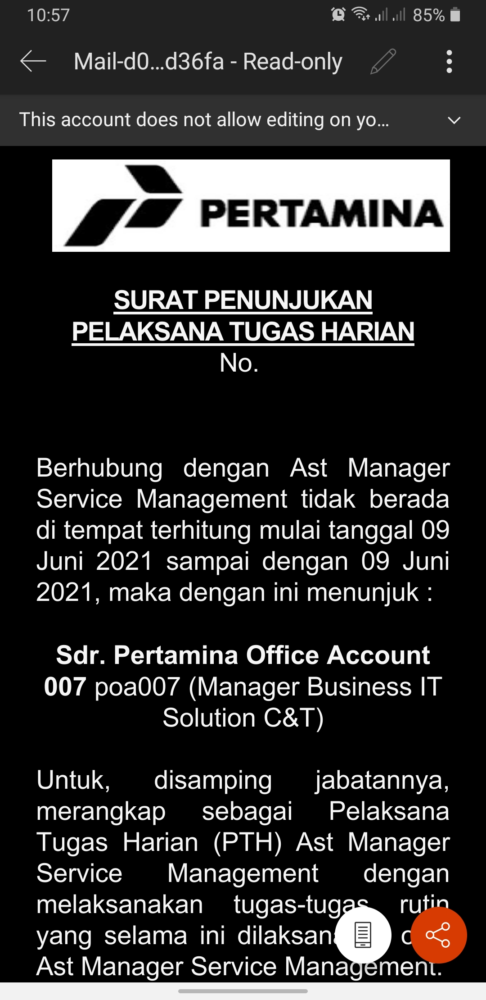

4. Isi surat akan otomatis tersimpan. Jika surat akan disimpan sebagai draft, maka **Back** ke halaman sebelumnya. Kemudian sistem akan menampilkan pop up konfirmasi sudah selesai melakukan _editting document_ pilih **yes**.
    
 

5. Surat yang sudah selesai diubah maka akan tersimpan di menu “**Draft”**

#### **Kirim SPPTH**

Langkah – langkah untuk mengirim SPPTH adalah sebagai berikut.

1. Pada tampilan _preview_ SPPTH, klik **Send Document** untuk mengirim SPPTH ke _approver_

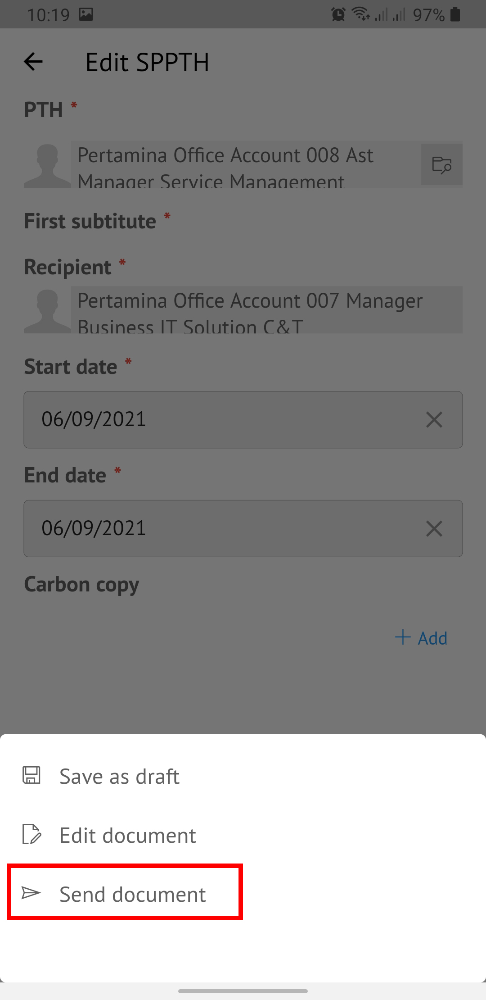

2. Sistem menyimpan perubahan dan SPPTH akan tersimpan di menu “**Sent Item**”
