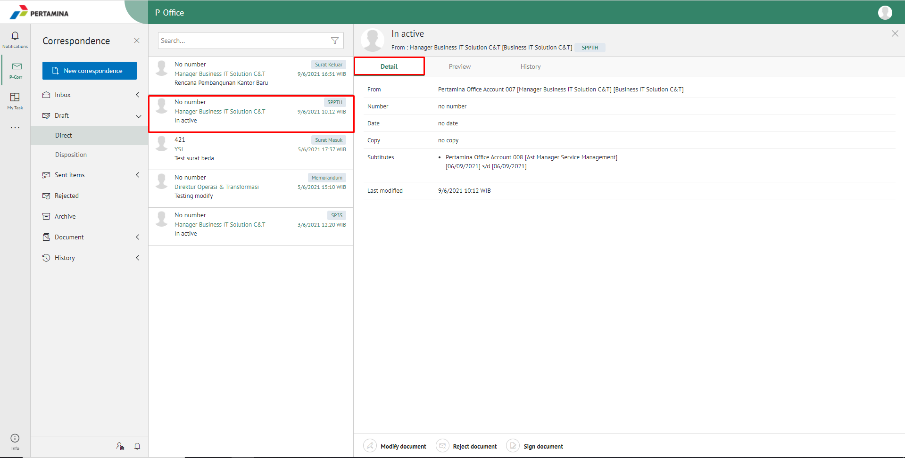
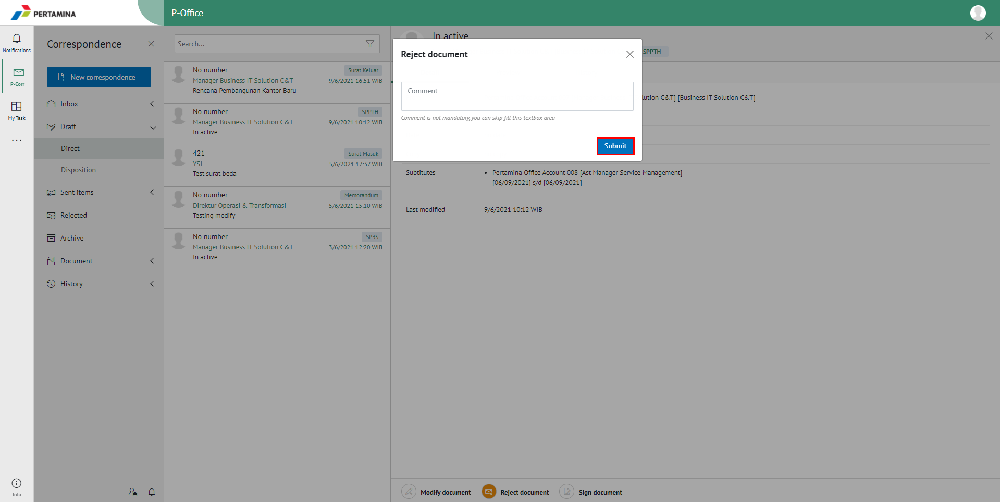
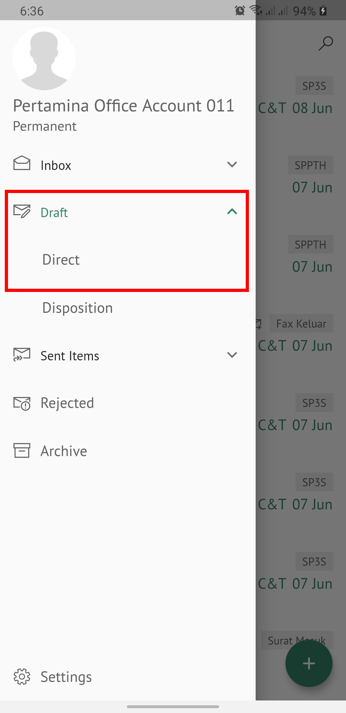
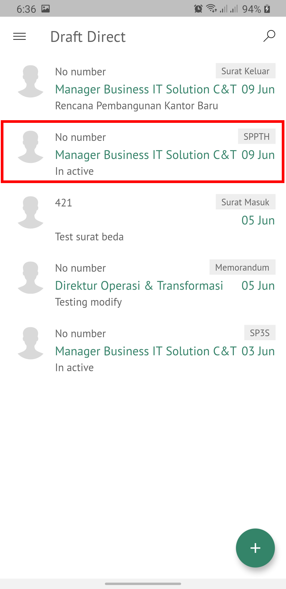
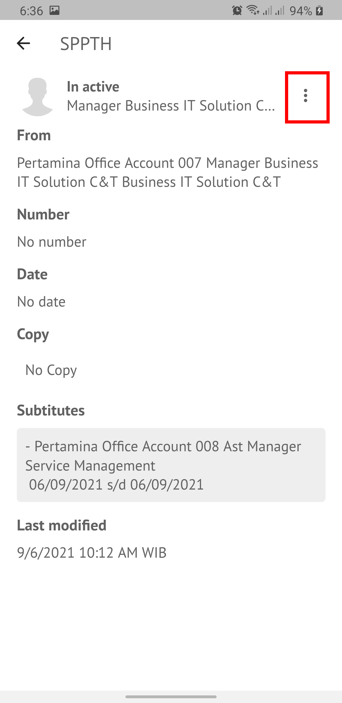
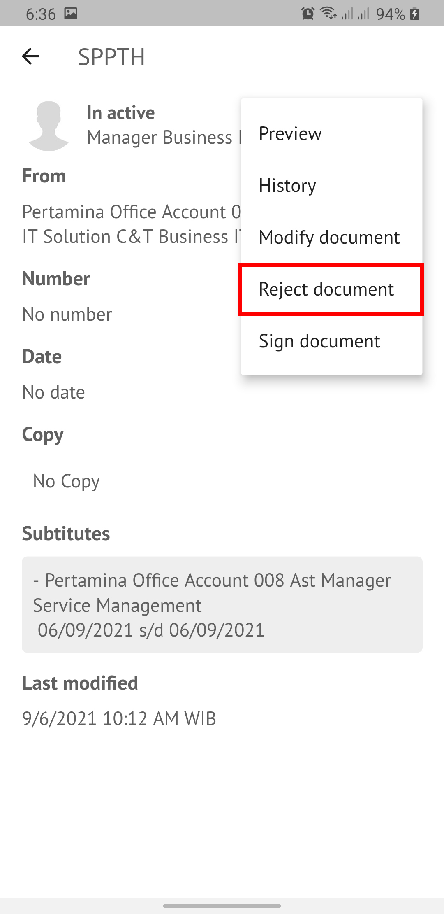
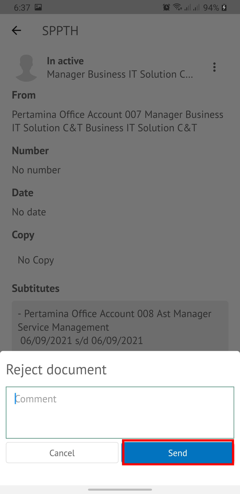

**Role yang sesuai**

- *Approver User*

*User* dapat menolak SPPTH yang sudah dikirimkan oleh konseptor. 

## **P-Office Versi Web**

Langkah-langkah untuk menolak SPPTH via web adalah sebagai berikut :

1. Klik menu **Draft** dan pilih surat berlabel **SPPTH**.

2. Pilih SPPTH yang akan disetujui kemudian pilih tab **Detail**.

3. Klik tombol **Reject**, kemudian pilih **Submit**. Isikan komentar jika diperlukan.

 

4.	Sistem berhasil menyimpan perubahan. SPPTH yang sudah di kirim akan akan akan terhapus dari aplikasi akan tersimpan di menu **“Rejected – SPPTH”** user penolak dengan label **Rejected**.

## **P-Office Versi Mobile (Android & iOS)**

Langkah - langkah untuk menolak SPPTH via Android dan iOS adalah sebagai berikut :

1. Klik menu **Draft** dan pilih salah satu surat berlabel **SPPTH**
   
 

2. Pilih _icon_ **Option**

3. Pilih button lalu **Reject document** kemudian sistem menampilkan pop up dan Isikan komentar jika diperlukan lalu pilih **Send**.

 

4. SPPTH yang sudah ditolak akan tersimpan dimenu “**Rejected”** user pengirim dengan label **SPPTH**.
