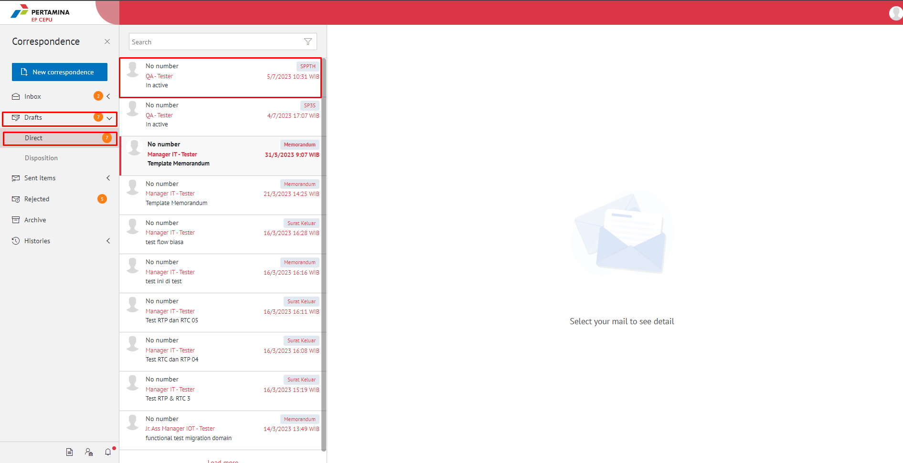
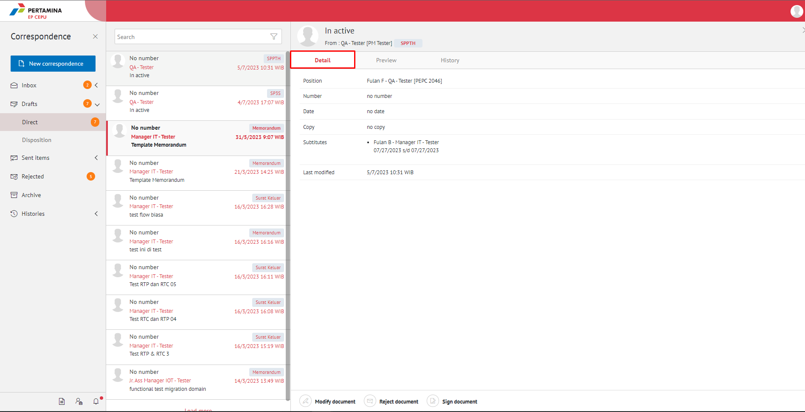
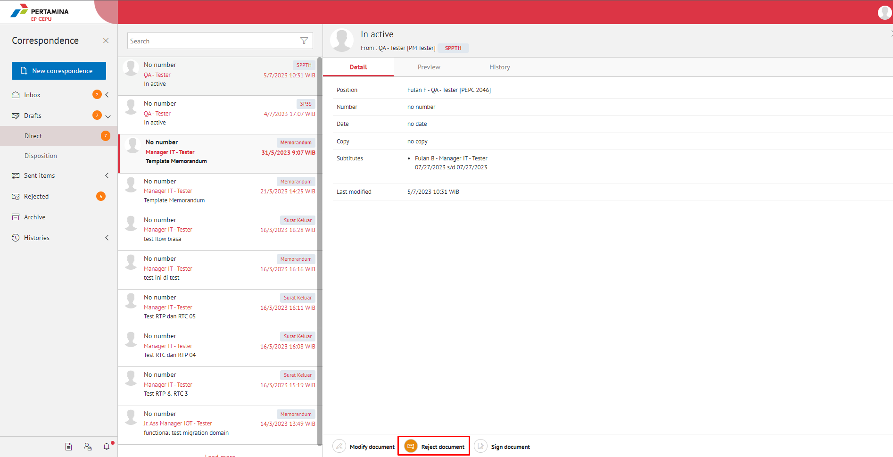

**Role yang sesuai**

- *Approver User*

*User* dapat menolak SPPTH yang sudah dikirimkan oleh konseptor. 

## **E-Corr Versi Web**

Langkah-langkah untuk menolak SPPTH via web adalah sebagai berikut :

1. Klik menu **Draft - Direct** dan pilih surat berlabel **SPPTH**.

2. Pilih SPPTH yang akan disetujui kemudian pilih tab **Detail**.

3. Klik tombol **Reject document**, kemudian pilih **Submit**. Isikan komentar jika diperlukan.

 

4.	Sistem berhasil menyimpan perubahan. SPPTH yang sudah di kirim akan akan akan terhapus dari aplikasi akan tersimpan di menu **“Rejected** selanjutnya di list akan ditampilkan surat jenis SPPTH user penolak dengan label **Rejected**.

